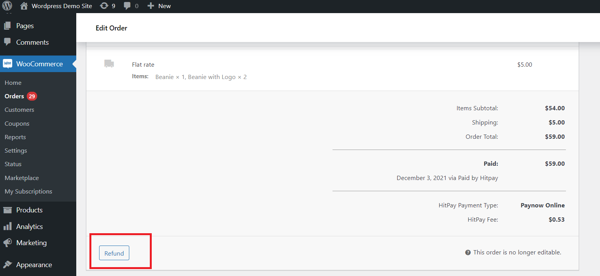
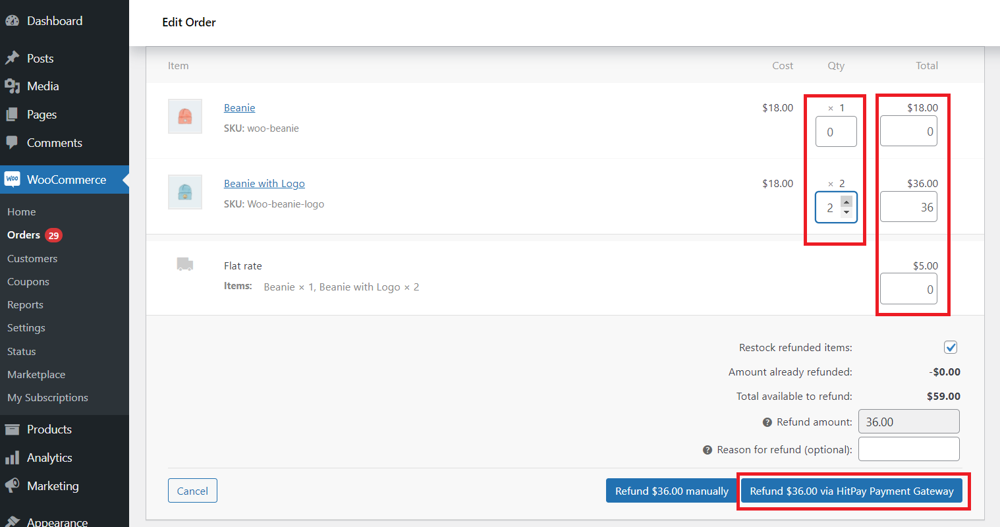
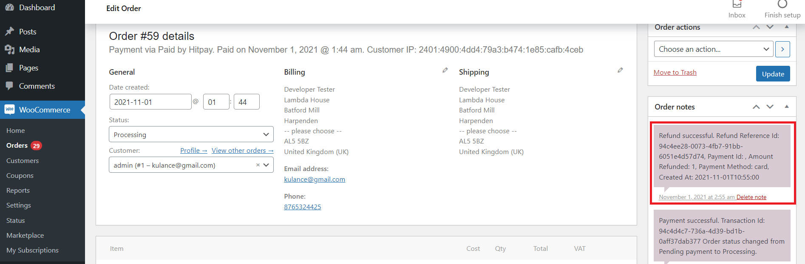
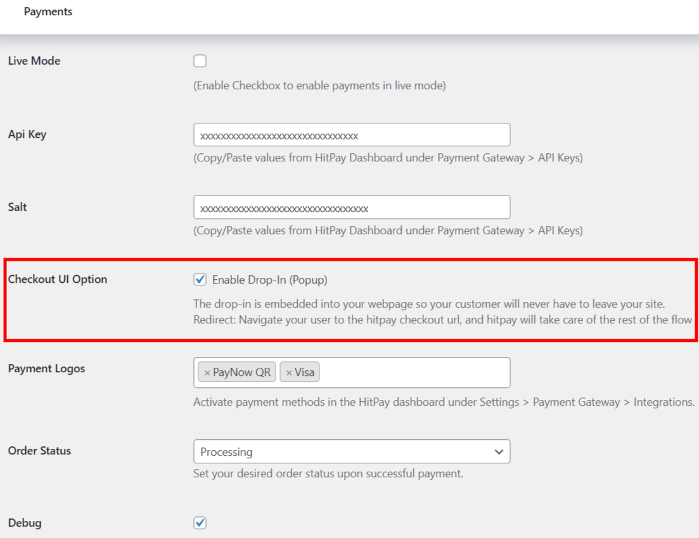
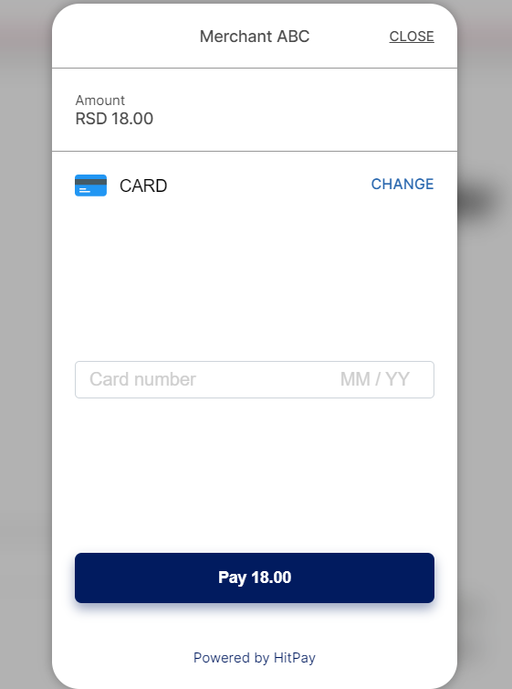

# HitPay 

=== HitPay Payment Gateway for WooCommerce ===
Contributors: HitPay
Tags: hitpay, payment gateway, woocommerce, QR code
Requires at least: 4.0
Tested up to: 6.8
Stable tag: 4.1.9
Requires PHP: 5.5
WC requires at least: 2.4
WC tested up to: 9.8.1
License: MIT

HitPay Payment Gateway Plugin allows HitPay merchants to accept PayNow QR, Cards, Apple Pay, Google Pay, WeChatPay, AliPay and GrabPay Payments.

== Description ==

HitPay Payment Gateway Plugin allows HitPay merchants to accept PayNow QR, Cards, Apple Pay, Google Pay, WeChatPay, AliPay and GrabPay Payments.

This plugin would communicate with 3rd party HitPay payment gateway(https://www.hitpayapp.com/) in order to process the payments.

Merchant must create an account with HitPay payment gateway(https://www.hitpayapp.com/).

Pay only per transaction. No monthly, setup, admin or any hidden service fees.

Merchant once created an account with HitPay payment gateway(https://www.hitpayapp.com/), they can go to thier HitPay dashboard and choose the payment options they would to avail for their site.

And merchant need to copy the API keys and Salt values from the HitPay Web Dashboard under Settings > Payment Gateway > API Keys

== Installation ==

= Using The WordPress Dashboard =

1. Navigate to the 'Add New' in the plugins dashboard
2. Search for 'HitPay Payment Gateway'
3. Click 'Install Now'
4. Activate the plugin on the Plugin dashboard

= Uploading in WordPress Dashboard =

1. Navigate to the 'Add New' in the plugins dashboard
2. Navigate to the 'Upload' area
3. Select `hitpay-payment-gateway.zip` from your computer
4. Click 'Install Now'
5. Activate the plugin in the Plugin dashboard

= Using FTP =

1. Download `hitpay-payment-gateway.zip`
2. Extract the `hitpay-payment-gateway` directory to your computer
3. Upload the `hitpay-payment-gateway` directory to the `/wp-content/plugins/` directory
4. Activate the plugin in the Plugin dashboard

= Updating =

Automatic updates should work like a charm; as always though, ensure you backup your site just in case.

== Configuration ==

1. Go to WooCommerce settings
2. Select the "Payments" tab
3. Activate the payment method (if inactive)
4. Set the name you wish to show your users on Checkout (for example: "HitPay or Creditcard")
5. Fill the payment method's description (for example: "Pay with HitPay")
6. Copy the API keys and Salt values from the HitPay Web Dashboard under Settings > Payment Gateway > API Keys
7. Select the payment gateway logos.
8. Click "Save Changes"
9. All done!

== Checkout ==

== Refunds ==

1. Log in to Admin
2. Navigate to Wocommerce ⇒ Orders
3. Click view icon link/row to navigate to Admin Order Details page.
4. Scroll down to locate the Refund button as like below screen:

5. If order is paid via 'HitPay Payment Gateway' then Woocommerce by default will display this button 'Refund xx via HitPay Payment Gateway' as attached screen:

6. If gateway accepted the refund request and the Refund details will be added to order history.
7. Only one refund is allowed per transaction.
8. Refund is only applicable if the initial charge was made with PayNow or Card.

== Checkout UI Drop-in (Popup) Settings ==

== Checkout UI Drop-in (Popup) ==

== Frequently Asked Questions ==

= Do I need an API key? =

Yes. You can copy the API keys and Salt values from the HitPay Web Dashboard under Settings > Payment Gateway > API Keys.

= Where can I find more documentation on your service? =

You can find more documentation about our service on our [get started](https://hitpay.zendesk.com/hc/en-us/sections/360002421091-About-HitPay) page, our [technical documentation](https://hitpay.zendesk.com/hc/en-us/articles/900004225243-HitPay-WooCommerce-Payment-Gateway-Singapore-How-to-update-the-HitPay-WooCommerce-Plugin-) page or our [resources](https://hit-pay.com/docs.html) page.
If there's anything else you need that is not covered on those pages, please get in touch with us, we're here to help you!

= Where can I get support? =

The easiest and fastest way is via our live chat on our [website](https://www.hitpayapp.com/) or via our [contact form](https://www.hitpayapp.com/contactus).

== Screenshots ==

1. The settings panel used to configure the gateway.
2. Normal checkout with HitPay Payment Gateway.

== Changelog ==

= 4.1.9 =
* Apr 15, 2025
* Added Test Connection View Error Details button
* Applied Plugin Check (PCP) Recemmendations for the latest version 1.4.0
* Plugin tested on WooCommerce 9.8.1
* Plugin tested on WordPress 6.7.2

= 4.1.8 =
* Apr 11, 2025
* Added Test Connection button
* Applied Plugin Check (PCP) Recemmendations for the latest version 1.4.0
* Plugin tested on WooCommerce 9.8.1
* Plugin tested on WordPress 6.7.2

= 4.1.7 =
* Mar 23, 2025 and Jan 15, 2025
* Applied various security fixes
* Applied more Plugin Check Recemmendations
* Fixed payment status page stuck when extra P tag wrapped around scripts with third party plugins in use like Elementor
* Now upto 30 POS terminals can be added
* Plugin tested on WooCommerce 9.7.1
* Plugin tested on WordPress 6.7.2

= 4.1.6 =
* Jul 23, 2024
* Plugin tested on WooCommerce 9.1.2
* Plugin tested on WordPress 6.6

= 4.1.5 =
* Jul 18, 2024
* Fixed equal operator issue on webhook
* Plugin tested on WooCommerce 9.0.2
* Plugin tested on WordPress 6.5.5

= 4.1.4 =
* Jul 15, 2024
* Applied various security fixes
* Applied Plugin Check Recemmendations
* Fixed Hitpay Fee Currency Issue
* Plugin tested on WooCommerce 9.0.2
* Plugin tested on WordPress 6.5.5

= 4.1.3 =
* Apr 12, 2024
* Added DuitNow, Touch n Go and Boost logos
* Plugin tested on WooCommerce 8.7.0
* Plugin tested on WordPress 6.5.2

= 4.1.2 =
* Apr 2, 2024
* Resolved conflict error with hitpay for givewp plugin
* Plugin tested on WooCommerce 8.7.0

= 4.1.1 =
* Feb 26, 2024
* Fixed refud error when amount is greater than or equal to 1000
* Fixed logo display compatible to custom themes
* Fixed empty payment box while drop-in enabled.
* Added new option to customize the place order button.
* Plugin tested on WordPress 6.4.3
* Plugin tested on WooCommerce 8.6.1

= 4.1.0 =
* Now it is compatible to High-Performance Order Storage

= 4.0.9 =
* Webhook order_id param changed since some third party plugin intercept this and prevented the webhook execution

= 4.0.8 =
* Now it is compatible to block based checkout - Drop-In (Popup) and POS option with Form Build

= 4.0.7 =
* Now it is compatible to block based checkout - redirect option

= 4.0.6 =
* Return URL query string changed

= 4.0.5 =
* Applied 2 styles to logo display

= 4.0.4 =
* Fix Log file

= 4.0.3 =
* Drop-In (POPUP) option included. The drop-in is embedded into your webpage so your customer will never have to leave your site.
* Fixed bugs to make it compatible with WooCommerce Pos plugin

= 4.0.2 =
* Fixed Mobile and Tablet Logo display css issue
* Fixed Mobile and Tablet POS terminal selection css issue

= 4.0.1 =
* For POS payments, new tab is added, where merchant can add upto 5 terminal ids with cashier email id field
* Payment method selection UI changed for POS Card reader terminal selection

= 4.0.0 =
* Now merchant can enable POS payments
* Payment method selection UI changed
* Plugin tested on WordPress 6.2.1
* Plugin tested on WooCommerce 7.5.1

= 3.2.5 =
* Added Atome Plus logos and Philipines payment gateways logos(Unionbank, QR PH, PESONet, GCash, Billease BNPL)
* Added eftpos, maestro, Alfamart, Indomaret, DANA, gopay, Link Aja!, OVO, QRIS, Bank Danamon, and PermataBank payment gateways logos
* Added Bank Syariah Indonesia, BCA, BNI, BRI, CIMB Niaga, DOKU, Mandiri, Akulaku BNPL, and Kredivo BNPL payment gateways logos
* Added PHILTRUST BANK, AllBank, ASIA UNITED BANK, CHINABANK, instaPay, LANDBANK, Metrobank, PNB, and QUEENBANK payment gateways logos
* Added RCBC, TayoCash, USSC, bayad, CEBUANA LHUILLIER, ecPay, PALAWAN PAWNSHOP, BPI, PSBank, and Robinsons Bank payment gateways logos
* Added Diners Club, Discover payment gateways logos
* Added DOKU Wallet, PayLater by Grab, FavePay, and ShopBack PayLater payment gateways logos
* Plugin tested on WordPress 6.1.1
* Plugin tested on WooCommerce 7.4.1

= 3.2.4 =
* Added an option to customize payment status display on the order thank you page after redirected from the gateway
* Added an option to control the CSS styles for HitPay Payment status display container on the order thank you page.
* Plugin tested on WordPress 6.0.1
* Plugin tested on WooCommerce 6.7.0

= 3.2.3 =
* Added Apple pay and Google pay logos

= 3.2.2 =
* Added FPX and Zip payment logos and removed hoola payment logo

= 3.2.1 =
* Fixed Uncaught Error: Non-static method WC_Legacy_Cart::get_checkout_url() cannot be called statically.

= 3.2.0 =
* Expires after parameter added to the payment request, if this option is enabled and expiry time set, then checkout URL will expired after set time.

= 3.1 =
* Fixed Uncaught Error: Class WC_Payment_Class not found during the update time woocommerce plugin went to inactive.

= 3.0 =
* Customized for custom-order-numbers-for-woocommerce plugin

= 2.9 =
* Payment details displayed on admin order totals
* Order status selection option provided for successful payment
* Customized payment title 

= 2.8 =
* Added Refund Option

= 2.7 =
* Added simulator for CURL if not enabled on the server
* Sending sitename to the gateway(helpful for the multi sites)

= 2.6 =
* Fixed - webhook executing multiple times.

= 2.5 =
* Fix payment method text position

= 2.4 =
* If customer click back button, check the order status if paid before cancelling the order.

= 2.3 =
* Resolved a bug

= 2.2 =
* Resolved a bug

= 2.1 =
* Removed payment logos select option as mandatory.
* Internal server error catched and updating the order status as failed.
* Displaying the payment type used by customer to make payment in the admin order view.

= 2.0 =
* Initial release.